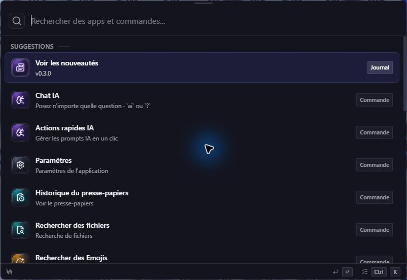
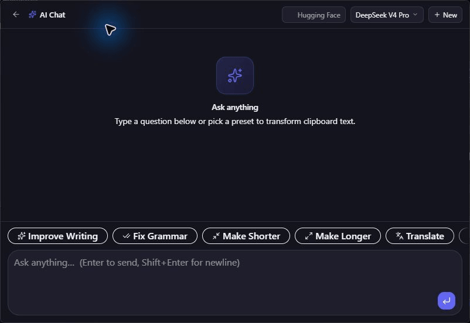
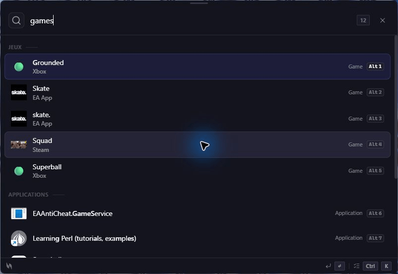
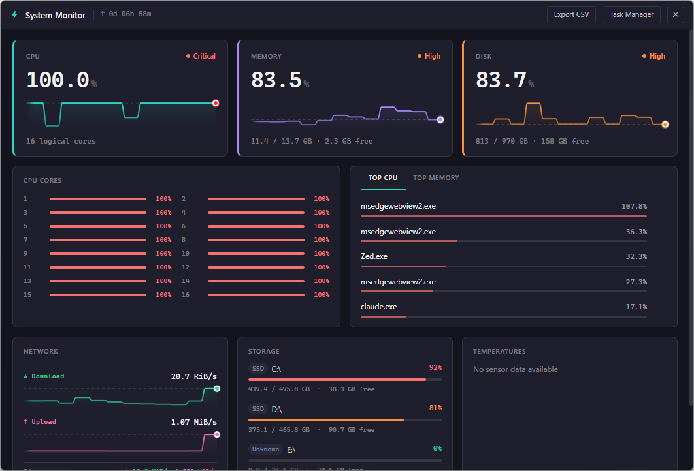
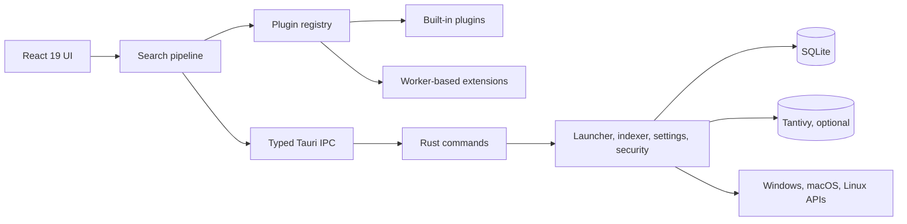

<div align="center">


# Volt

### Everything on your computer. One shortcut.

**An open-source, keyboard-first launcher for Windows, macOS, and Linux.**

[](https://github.com/VoltLaunchr/Volt/actions/workflows/check.yml)
[](https://github.com/VoltLaunchr/Volt/releases/latest)
[](./LICENSE)
[](https://github.com/VoltLaunchr/Volt/releases/latest)
[](https://tauri.app/)

[Website](https://voltlaunchr.com) · [Download](https://github.com/VoltLaunchr/Volt/releases/latest) · [Documentation](https://voltlaunchr.com/en/docs) · [Roadmap](./docs/build-release/ROADMAP.md) · [Contributing](./CONTRIBUTING.md)

<br />



<br />

<table>
  <tr>
    <td align="center" width="33%">
      
      <br /><sub><strong>AI workflows</strong></sub>
    </td>
    <td align="center" width="33%">
      
      <br /><sub><strong>Game library</strong></sub>
    </td>
    <td align="center" width="33%">
      
      <br /><sub><strong>System monitor</strong></sub>
    </td>
  </tr>
</table>

</div>

> [!NOTE]
> Volt is currently in beta. Features, platform behavior, and installer signing can change between releases. Check the [latest release notes](https://github.com/VoltLaunchr/Volt/releases/latest) before installing.

## Why Volt?

Volt brings applications, files, commands, clipboard history, notes, snippets, games, and extensions into one fast interface. Press the global shortcut, type what you need, and continue without leaving the keyboard.

| Principle          | What it means                                                                                                   |
| ------------------ | --------------------------------------------------------------------------------------------------------------- |
| **Keyboard first** | Search, navigate, preview, and execute actions without reaching for the mouse.                                  |
| **Local first**    | Core launcher data and indexes are stored on your device. Network access is used only by features that need it. |
| **Native core**    | Rust and Tauri 2 provide OS integration without shipping an Electron runtime.                                   |
| **Extensible**     | Built-in plugins and permissioned TypeScript extensions share a consistent result and action model.             |
| **Open source**    | The application, architecture, roadmap, and security policy are public under Apache 2.0.                        |

## Highlights

### Search and launch

- Search applications, files, folders, games, commands, and plugin results together.
- Rank frequently used items with frecency while protecting the UI from stale search responses.
- Filter files with operators such as `ext:pdf`, `in:downloads`, `size:>10mb`, and `modified:<7d`.
- Keep the file index synchronized through SQLite, filesystem watching, and optional Tantivy search.
- Preview supported files and inspect metadata before opening them.

### Built-in workflows

- Calculator, unit conversion, dates, and time zones.
- Clipboard history, reusable snippets, quicklinks, notes, and custom emoji.
- Shell commands with streamed output and searchable history.
- Web search, timers, Pomodoro sessions, window management, and system commands.
- Multi-store game discovery and launching.
- System monitoring for CPU, disks, network, processes, temperatures, and uptime.
- Optional AI chat and quick actions using configured providers.

### Extensibility and safety

- Built-in plugins are registered through a single TypeScript registry with per-plugin timeouts.
- External extensions run in a restricted Web Worker when supported and request explicit permissions.
- Extension network requests pass through backend checks for private addresses, redirects, sensitive headers, and response size.
- Sensitive credentials use the operating system keyring where supported.
- Tauri capabilities scope privileged commands by window.

Extension isolation is defense in depth, not an operating-system security boundary. See [Security](#security-and-privacy) for the reporting policy and current guarantees.

## Install

Download the newest build from [GitHub Releases](https://github.com/VoltLaunchr/Volt/releases/latest).

| Platform          | Release assets                    |
| ----------------- | --------------------------------- |
| **Windows 10/11** | NSIS `.exe` or MSI `.msi`         |
| **macOS**         | `.dmg` for Apple Silicon or Intel |
| **Linux**         | `.deb`, `.rpm`, or `.AppImage`    |

Code-signing and notarization status can vary while Volt is in beta. Review the notes for the specific release and verify published checksums when available.

After launching Volt, press `Ctrl+Space` by default. The global shortcut is configurable in Settings.

## Quick Tour

| Type                | Example                       | Result                               |
| ------------------- | ----------------------------- | ------------------------------------ |
| Application or file | `visual studio`               | Search indexed apps and files        |
| File filters        | `report ext:pdf modified:<7d` | Find recent PDF reports              |
| Calculator          | `5km in mi`                   | Convert values inline                |
| Shell               | `> git status`                | Run a command with streamed output   |
| Web search          | `? rust ownership`            | Search with the configured provider  |
| Emoji               | `: rocket`                    | Find and copy an emoji               |
| Timer               | `timer 25m`                   | Start a focus timer                  |
| Quicklink           | `ql: docs`                    | Open a saved URL, folder, or command |

See the [user documentation](https://voltlaunchr.com/en/docs) and [keyboard shortcut reference](./docs/user-guide/SHORTCUTS.md) for the complete workflow.

## Build From Source

### Prerequisites

- [pnpm](https://pnpm.io) for frontend dependencies, scripts, and tests.
- [Rust stable](https://rustup.rs/) for the Tauri backend.
- The [Tauri 2 system prerequisites](https://tauri.app/start/prerequisites/) for your operating system.
- [Git](https://git-scm.com/) for cloning and contribution workflows.

### Development

```bash
git clone https://github.com/VoltLaunchr/Volt.git
cd Volt
pnpm install
pnpm run tauri -- dev
```

For frontend-only work:

```bash
pnpm run dev
```

Create a production bundle for the current platform:

```bash
pnpm run tauri -- build
```

Build artifacts are written under `src-tauri/target/release/bundle/`.

## Quality Checks

The pull request workflow validates frontend code, Rust formatting, strict Clippy checks, generated IPC bindings, the default/Tantivy test path, and the SQLCipher feature path.

```bash
# Frontend
pnpm run lint
pnpm run build
pnpm run test

# Rust: primary CI path
cd src-tauri
cargo fmt --check
cargo clippy --all-targets --features tantivy-search -- -D warnings
cargo test --workspace --lib --features tantivy-search

# Rust: encrypted database matrix
cargo clippy --all-targets --no-default-features --features sqlcipher -- -D warnings
cargo test --workspace --lib --no-default-features --features sqlcipher
```

End-to-end tests are available through `pnpm run test:e2e` when the Playwright environment is configured.

## Architecture



| Area              | Location                  | Responsibility                                                              |
| ----------------- | ------------------------- | --------------------------------------------------------------------------- |
| Application shell | `src/app/`                | Lifecycle, search orchestration, global shortcuts, and view routing         |
| Product features  | `src/features/`           | Search, settings, notes, extensions, clipboard, and plugin UI               |
| Shared frontend   | `src/shared/`             | Reusable components, types, constants, and utilities                        |
| Tauri commands    | `src-tauri/src/commands/` | Typed IPC entry points for privileged operations                            |
| Core services     | `src-tauri/src/`          | Indexing, launching, hotkeys, windows, plugins, storage, and security       |
| Documentation     | `docs/`                   | Architecture, user guides, extension development, release, and roadmap docs |

Read the [architecture overview](./docs/architecture/ARCHITECTURE.md) and [Rust module guide](./src-tauri/MODULES.md) for implementation details.

## Extensions

Volt has two extension surfaces:

| Surface                  | Location                                                                      | Use it for                                                                |
| ------------------------ | ----------------------------------------------------------------------------- | ------------------------------------------------------------------------- |
| **Built-in plugins**     | `src/features/plugins/builtin/`                                               | Features maintained and released with the core application                |
| **Community extensions** | [VoltLaunchr/volt-extensions](https://github.com/VoltLaunchr/volt-extensions) | Independently distributed TypeScript extensions with declared permissions |

Start with the [extension development guide](./docs/plugins/DEVELOPMENT.md), [API reference](./docs/plugins/API_REFERENCE.md), and [publishing guide](./docs/plugins/PUBLISHING_GUIDE.md).

## Documentation

| Topic                    | Resource                                                                   |
| ------------------------ | -------------------------------------------------------------------------- |
| User documentation       | [voltlaunchr.com/en/docs](https://voltlaunchr.com/en/docs)                 |
| Documentation index      | [docs/README.md](./docs/README.md)                                         |
| Architecture             | [docs/architecture/ARCHITECTURE.md](./docs/architecture/ARCHITECTURE.md)   |
| Feature catalog          | [docs/architecture/FEATURES.md](./docs/architecture/FEATURES.md)           |
| Keyboard shortcuts       | [docs/user-guide/SHORTCUTS.md](./docs/user-guide/SHORTCUTS.md)             |
| Distribution and signing | [docs/build-release/DISTRIBUTION.md](./docs/build-release/DISTRIBUTION.md) |
| Roadmap                  | [docs/build-release/ROADMAP.md](./docs/build-release/ROADMAP.md)           |
| Changelog                | [CHANGELOG.md](./CHANGELOG.md)                                             |

## Security and Privacy

Volt is local first: application data, settings, history, and file indexes are designed to remain on the device. Optional features can communicate with external services, including update checks, the extension registry, cloud sync, integrations, web search, and configured AI providers.

For security issues, do not open a public bug report. Use a [private GitHub Security Advisory](https://github.com/VoltLaunchr/Volt/security/advisories/new) or follow the contact process in [SECURITY.md](./SECURITY.md).

Current product claims and review evidence are tracked in [CLAIMS_EVIDENCE.md](./docs/marketing/CLAIMS_EVIDENCE.md) and [PRIVACY_AND_TELEMETRY_REVIEW.md](./docs/security/PRIVACY_AND_TELEMETRY_REVIEW.md).

## Contributing

Contributions are welcome across code, tests, documentation, translations, design, and extensions.

1. Read [CONTRIBUTING.md](./CONTRIBUTING.md) and [CODE_OF_CONDUCT.md](./CODE_OF_CONDUCT.md).
2. Fork the repository and create a focused branch.
3. Add or update tests for behavioral changes.
4. Run the relevant quality checks locally.
5. Open a pull request with a clear description of the problem and solution.

Commit messages follow [Conventional Commits](https://www.conventionalcommits.org/). Larger changes should start with an issue or discussion so the design can be agreed before implementation.

## Support and Community

- [GitHub Issues](https://github.com/VoltLaunchr/Volt/issues) for reproducible bugs and feature requests.
- [GitHub Discussions](https://github.com/VoltLaunchr/Volt/discussions) for questions, ideas, and project discussion.
- [Documentation](https://voltlaunchr.com/en/docs) for installation and usage guidance.
- [Security policy](./SECURITY.md) for confidential vulnerability reports.

## Project Status

Volt is a pre-1.0 project under active development. Current priorities include release hardening, installer signing and notarization, search reliability, performance baselines, and the extension ecosystem. The detailed plan and acceptance criteria live in the [public roadmap](./docs/build-release/ROADMAP.md).

## License

Volt is licensed under the [Apache License 2.0](./LICENSE).

## Acknowledgments

Volt is inspired by tools such as [Spotlight](https://support.apple.com/guide/mac-help/spotlight-mchlp1008/mac), [Alfred](https://www.alfredapp.com/), and [Raycast](https://www.raycast.com/), and is built with [Tauri](https://tauri.app/), [React](https://react.dev/), [Rust](https://www.rust-lang.org/), [nucleo](https://github.com/helix-editor/nucleo), [Tantivy](https://github.com/quickwit-oss/tantivy), and [SQLite](https://www.sqlite.org/).

---

<div align="center">

**[Download Volt](https://github.com/VoltLaunchr/Volt/releases/latest) · [Read the docs](https://voltlaunchr.com/en/docs) · [Contribute](./CONTRIBUTING.md)**

If Volt improves your workflow, consider [starring the repository](https://github.com/VoltLaunchr/Volt).

</div>
